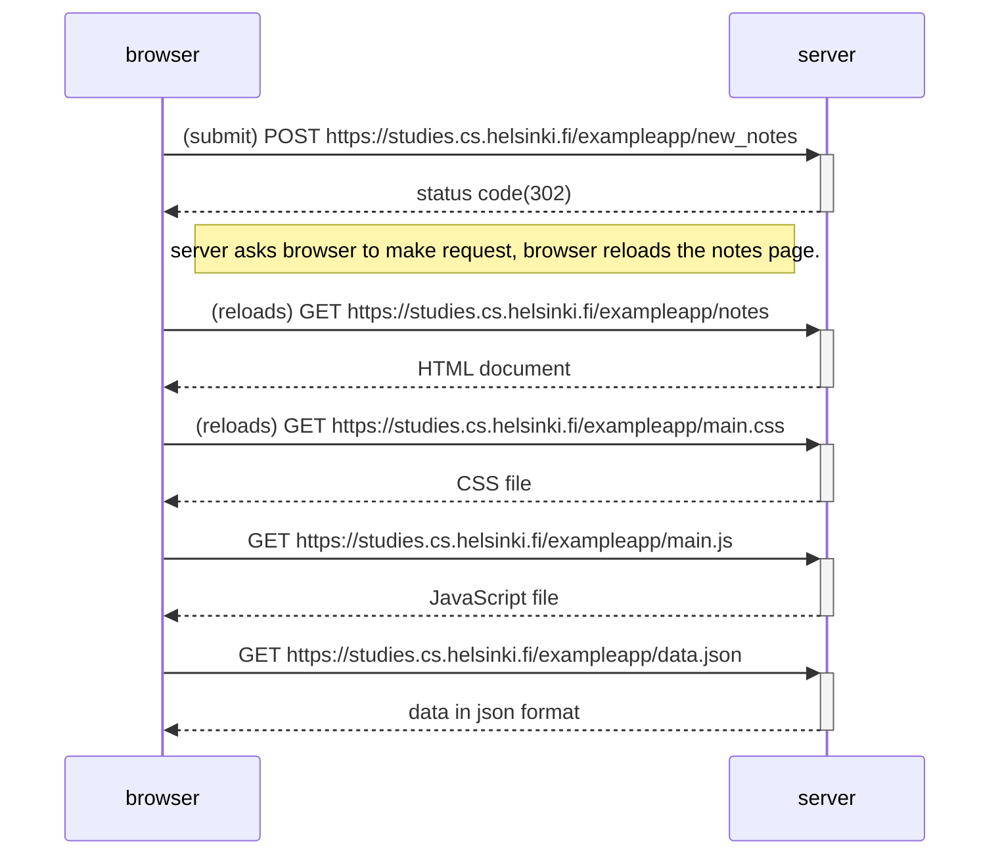

Sequence diagram showing how the new note is created in https://studies.cs.helsinki.fi/exampleapp/notes.

```mermaid
sequenceDiagram
    participant browser
    participant server

    browser->>+server: (submit) POST https://studies.cs.helsinki.fi/exampleapp/new_notes
    server-->>-browser : status code(302)

    Note right of browser: server asks browser to make request, browser reloads the notes page.

    browser->>+server: (reloads) GET https://studies.cs.helsinki.fi/exampleapp/notes
    server-->>-browser: HTML document

    browser->>+server: (reloads) GET https://studies.cs.helsinki.fi/exampleapp/main.css
    server-->>-browser: CSS file

    browser->>+server: GET https://studies.cs.helsinki.fi/exampleapp/main.js
    server-->>-browser: JavaScript file

     browser->>+server: GET https://studies.cs.helsinki.fi/exampleapp/data.json
     server-->>-browser: data in json format
    
```