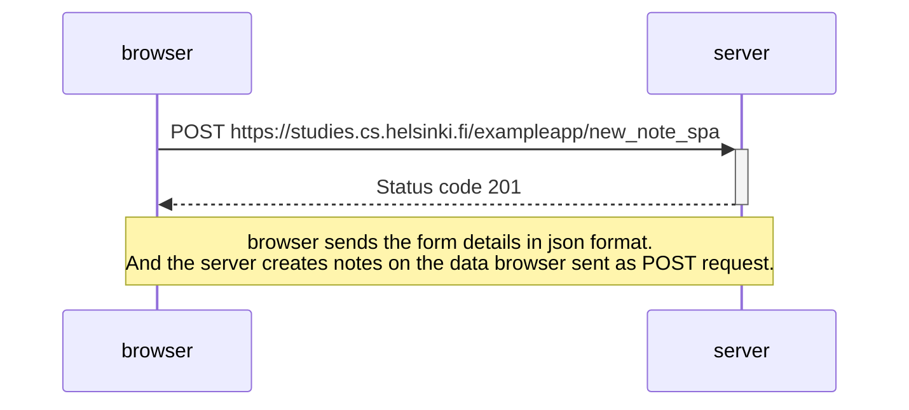

sequence diagram to show how new note is created in spa

```mermaid
sequenceDiagram
    participant browser
    participant server

    browser->>+server: POST https://studies.cs.helsinki.fi/exampleapp/new_note_spa
    server-->>-browser: Status code 201
    Note over browser, server: browser sends the form details in json format.<br/> And the server creates notes on the data browser sent as POST request.   
```